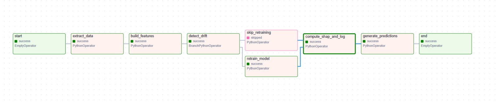

# Documentación del DAG y pipeline

Este documento contiene todo lo necesario para entender, ejecutar y entregar la parte de `Pipelines Productivos` implementada con Airflow en este repositorio.

Contenido rápido
- Descripción general del DAG y tareas.
- Diagrama del pipeline (Mermaid).
- Dónde está el código que implementa cada tarea.
- Cómo ejecutar localmente (Docker Compose + PowerShell).
- Cómo detectar *drift* y dónde ajustarlo.

---

## 1) Descripción general

Nombre del DAG: `sodai_ml_pipeline` (ver `airflow/dags/sodai_ml_pipeline_dag.py`).

Resumen: el DAG orquesta el proceso completo desde extracción de datos hasta generación de predicciones y guardado de artefactos. Se diseñó para ser reproducible en local con Docker Compose y para que, ante la detección de *drift*, la rama de re-entrenamiento se active de forma condicional.

Tareas principales (orden ejecutable):

- `start` — marcador de inicio (EmptyOperator).
- `extract_data` — extrae/coloca los datos necesarios (lee `transacciones.parquet`, `clientes.parquet`, `productos.parquet` desde `airflow/data`). Implementada como operador Python que usa funciones en `airflow/sodai_core/data_io.py`.
- `build_features` — transforma y construye las matrices de features para entrenamiento y scoring. Implementada en `airflow/sodai_core/features.py`.
- `detect_drift` — calcula métricas de comparación entre la ventana histórica y la nueva semana; decide si se debe re-entrenar. Invoca lógica en `airflow/sodai_core/features.py` (o en un helper llamado por el DAG) y devuelve una rama booleana.
- `skip_retraining` — rama cuando no se detecta drift (placeholder que permite continuar sin re-entrenar).
- `retrain_model` — re-entrena el modelo (usa `airflow/sodai_core/training.py` y guarda artefactos en `airflow/artifacts_entrega1/`).
- `compute_shap_and_log` — calcula SHAP y genera reportes / logs (usa `airflow/sodai_core/training.py` / `sodai_core` helpers).
- `generate_predictions` — ejecuta el scoring final y guarda predicciones en `airflow/data/predictions/`.
- `end` — marcador de fin (EmptyOperator).

Notas:
- Los artefactos (modelos, metadata, preprocesadores) se guardan en `airflow/artifacts_entrega1/`.
- Los scripts auxiliares y funciones están en `airflow/sodai_core/` (ver `data_io.py`, `features.py`, `training.py`, `inference.py`).

## 2) Diagrama del pipeline

Copie este bloque Mermaid en cualquier renderizador que acepte Mermaid para ver el diagrama:

```mermaid
flowchart LR
  start([start]) --> extract_data["extract_data"]
  extract_data --> build_features["build_features"]
  build_features --> detect_drift["detect_drift"]
  detect_drift -->|no drift| skip_retraining["skip_retraining"]
  detect_drift -->|drift| retrain_model["retrain_model"]
  skip_retraining --> compute_shap_and_log["compute_shap_and_log"]
  retrain_model --> compute_shap_and_log
  compute_shap_and_log --> generate_predictions["generate_predictions"]
  generate_predictions --> end([end])
```

También se incluye, como referencia visual, la captura del DAG usada durante desarrollo. El flujo muestra claramente la rama condicional entre `skip_retraining` y `retrain_model`.



## 3) Lógica de *drift* y re-entrenamiento

- **Dónde está implementado:** la lógica de detección de drift se ejecuta en la tarea `detect_drift` y llama a funciones dentro de `airflow/sodai_core/features.py` (o a un helper específico de drift dentro de `sodai_core`).
- **Qué comprueba:** comparación estadística simple entre la distribución de las features actuales y la distribución histórica (por ejemplo, cambios en medias, varianzas o contadores clave). Si la desviación supera un umbral configurable, el DAG activa la rama `retrain_model`.
- **Qué hace `retrain_model`:** re-entrena con la data actual (respetando la partición temporal), guarda el nuevo modelo y actualiza el `metadata.json` en la carpeta de artifacts.

Consejo práctico: para cambiar el umbral o la métrica de drift, edite la función de drift en `airflow/sodai_core/features.py` (buscar funciones con nombre `detect_drift` o similar). Los thresholds suelen estar como constantes o variables que se pueden parametrizar desde el DAG.

## 4) Cómo ejecutar y verificar (PowerShell / Windows)

Instrucciones rápidas para levantar Airflow y ejecutar el DAG en local (desde la raíz del repo):

1. Levantar la stack de Airflow (usa el `docker-compose.yml` dentro de la carpeta `airflow`):

```powershell
cd .\airflow
docker compose build
docker compose up -d
```

2. Abrir la interfaz web de Airflow (esperar unos segundos hasta que el scheduler y webserver estén listos):

  - URL: http://127.0.0.1:8080

3. En la UI de Airflow:

  - Buscar el DAG `sodai_ml_pipeline` en la lista.
  - Hacer click para ver el grafo y validar que las tareas estén presentes.
  - Trigger manual: usar el botón "Trigger DAG" para ejecutar un run manual.

4. Ejecutar y revisar logs:

```powershell
# Ver logs del scheduler
docker compose logs --follow airflow-scheduler

# Ejecutar un DAG manualmente desde el servicio scheduler (CLI inside container):
docker compose exec airflow-scheduler airflow dags trigger sodai_ml_pipeline

# Ver el log de una tarea específica (reemplazar task_id y run_id según UI):
docker compose logs --tail 200 airflow-scheduler
```

Notas de troubleshooting:
- Si alguna tarea falla por no encontrar archivos parquet dentro del contenedor, revise que el volumen `airflow/data` esté correctamente montado en `docker-compose.yml` y que los archivos existan en el host en `airflow/data/`.
- Si ve errores de importación de parquet (pyarrow/fastparquet), añada `pyarrow` a las dependencias del servicio donde se ejecuta la tarea o instale la dependencia en la imagen usada.

## 5) Rutas y artefactos importantes

- Datos de entrada: `airflow/data/transacciones.parquet`, `airflow/data/clientes.parquet`, `airflow/data/productos.parquet`.
- Artefactos y modelos: `airflow/artifacts_entrega1/artifacts/` y `airflow/artifacts_entrega1/artifacts_optuna/`.
- Código del DAG: `airflow/dags/sodai_ml_pipeline_dag.py`.
- Código de soporte (featurización / training / inference): `airflow/sodai_core/` (`data_io.py`, `features.py`, `training.py`, `inference.py`).

---
